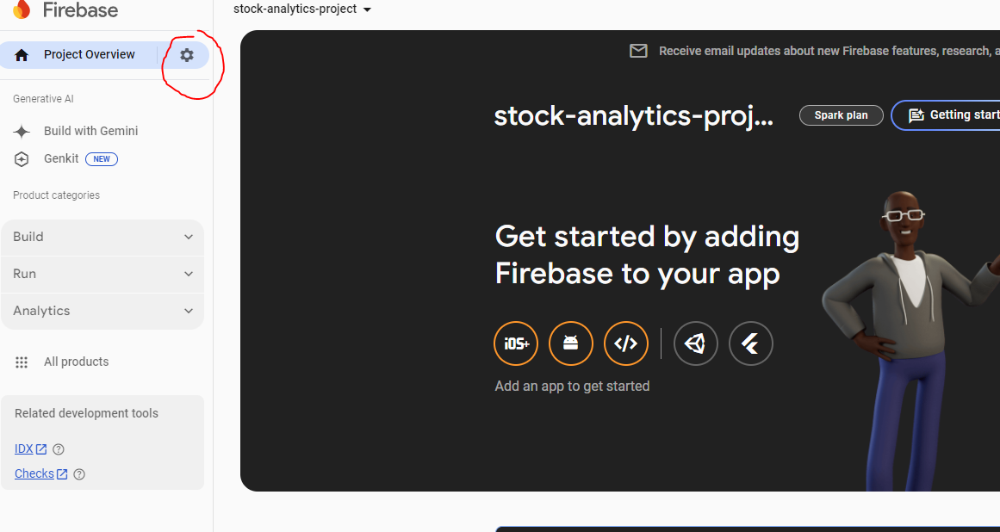
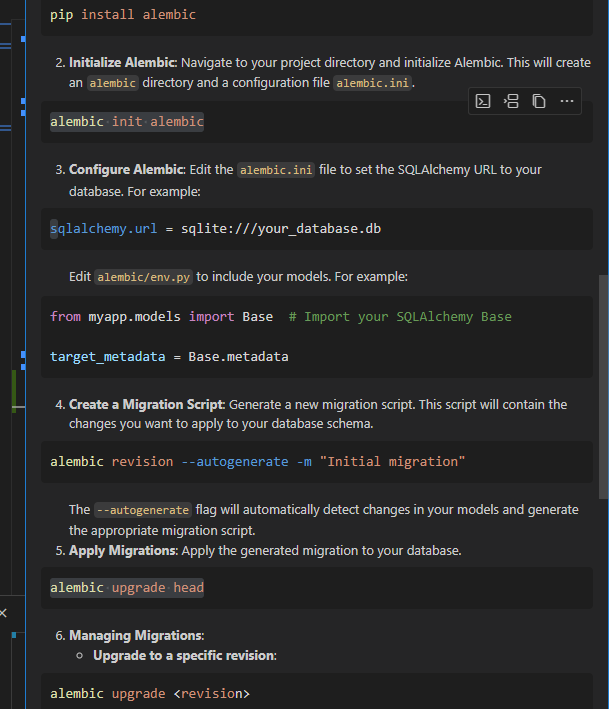

# stock_analytics

Steps to Set Up Firestore Emulator Locally:

npm install -g firebase-tools

firebase login

firebase init(and then select option below)
>( ) Emulators: Set up local emulators for Firebase products

Which Firebase emulators do you want to set up(select below)
>(*) Firestore Emulator

Start the Firestore Emulator: To start the Firestore emulator, use the following command:
firebase emulators:start --export-on-exit=./emulator-data
firebase emulators:start --import=./emulator-data

firebase emulators:start --import=exported-dev-data --export-on-exit=exported-dev-data

go to firebase console

https://console.firebase.google.com/project/stock-analytics-2025/overview

go to service account page

Go to the Firebase Console:

Navigate to the Firebase Console.
Select your Firebase Project:

Choose the Firebase project you’re working on.
Go to Project Settings:

Click on the gear icon ⚙️ next to "Project Overview" and select Project settings.
Generate a New Service Account Key:

In the settings page, go to the Service accounts tab.
Click on Generate new private key.
A JSON file containing the service account credentials will be downloaded to your computer.
Move the Key File:

Store the downloaded .json file in a secure location within your project directory.
The file should be placed somewhere you can reference in your code

** find taken port
netstat -a -n -o | findstr :8080

taskkill /PID 23268 /F

alembic init alembic

alembic revision --autogenerate -m "Initial migration"

alembic upgrade head

